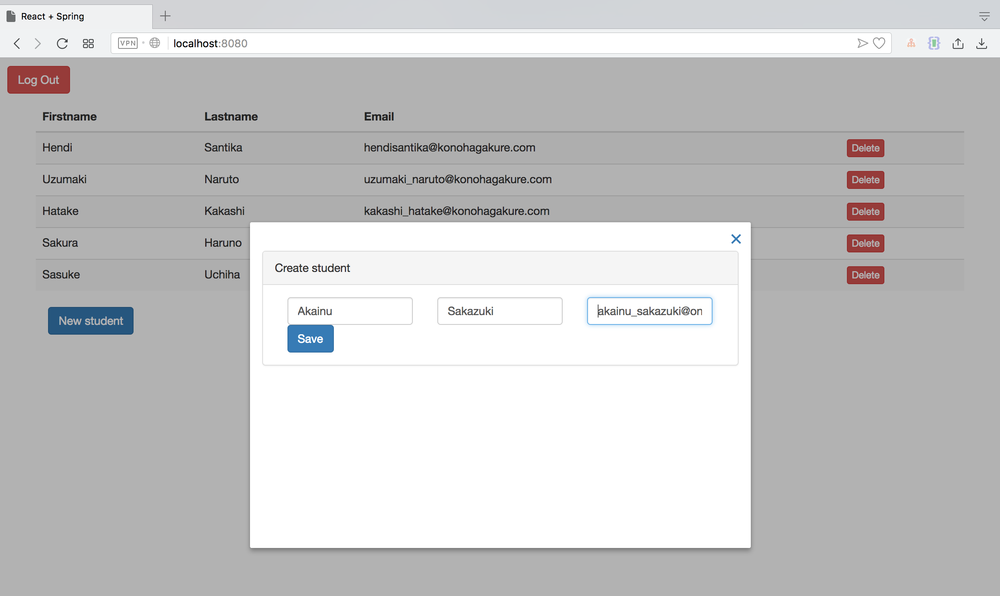
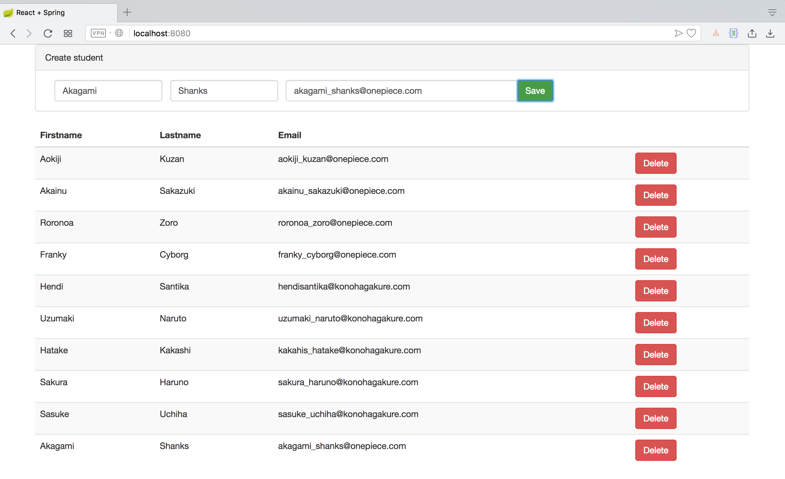

# SpringBootReact
Spring Boot + React.js

Spring Boot + React frontend

Launch by typing: mvnw spring-boot:run

Login by using: user/user or admin/admin

    H2 database
    JPA
    REST
    React.js
    React components: react-skylight (for modals), react-s-alert (for toasts)
    
##Screenshot##

